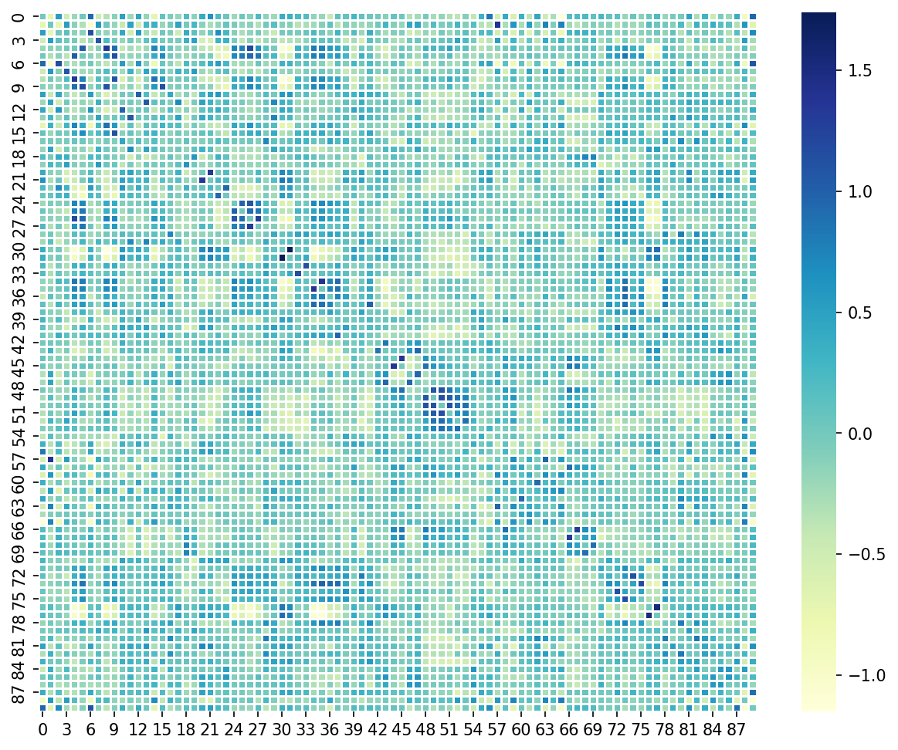
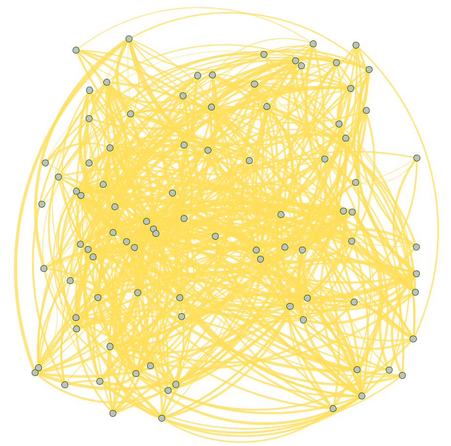

# ASD-Diagnosis-Using-Multimodal-MRI

**Official code for our paper "Diagnosis and Pathogenic Analysis of Autism Spectrum Disorder Using Fused Brain Connection Graph".**

This repository includes four GNN models of ASD Diagnose: GCN, GAT, ChebyNet and graphSAGE, two plotting codes and the MWU test code. The Python file ending with "+loss" is the model that introduces the Wasserstein Graph Distance.

Both CPU and GPU environments are supported.

## Requirements

Recommended version:

* **Python**: python 3.7 
* **torch**: torch 1.12.0

## Figures

Our charts are placed below：
### Figure 1: The overall framework of the proposed model. It consists of three modules.

### Figure 2: ROC curve for GCN, GAT, ChebyNet and graphSAGE.

### Figure 3: Hyper-parameter 𝑎 search.

### Figure 4: Mann-Whitney U test of 90 functional areas from the ASD group (orange) and the control group (blue).

### Figure 5: ASD related brain regions visualization. The left (right) panel shows the significant regions of the left (right) half of the brain from the lateral and dorsal views. And the middle panel displays the top 15 regions from the medial view.

