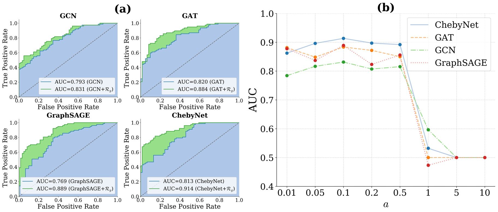

# ASD-Diagnosis-Using-Multimodal-MRI

**Official code for our paper "Diagnosis and Pathogenic Analysis of Autism Spectrum Disorder Using Fused Brain Connection Graph".**

This repository includes four GNN models of ASD Diagnose: GCN, GAT, ChebyNet and graphSAGE, two plotting codes and the MWU test code. The Python file ending with "+loss" is the model that introduces the Wasserstein Graph Distance.

Both CPU and GPU environments are supported.

## Requirements

Recommended version:

* **Python**: python 3.7 
* **torch**: torch 1.12.0

## Figures

Our charts are placed below：
### Figure 1: The overall framework of the proposed model. It consists of three modules.

### Figure 2: fMRI

### Figure 3: DTI

### Figure 4: Visualizations of ASD classification on TNR (left panel), TPR (middle panel), and AUC (right panel) (with standard deviation) of baseline methods and the proposed models, averaged over five cross-validation folds. (+ $\mathcal{R}_{g}$) denotes the proposed regularization-based GNN model.

### Figure 5: Comparisons on two fusion manners, ${\rm GNN}(\mathbf{A}=\mathbf{A}^{\rm DTI},\mathbf{X}=\mathbf{A}^{\rm fMRI})$ and  ${\rm GNN}(\mathbf{A}=\mathbf{A}^{\rm fMRI},\mathbf{X}=\mathbf{A}^{\rm DTI})$, namely, exchange the roles of $\mathbf{A}=\mathbf{A}^{\rm DTI},\mathbf{X}=\mathbf{A}^{\rm fMRI}$ in GNNs, where ${\rm GNN}$ can be selected from \{GCN, GAT, GraphSAGE, ChebyNet\}.

### Figure 6: (a) ROC curves of the four baselines (blue) and the corresponding proposed methods (green). (b) Searching for the penalty tuning parameter $\alpha$ of the four proposed models.

### Figure 7: The visualization depicts three distinct centralities of the Karate Club graph: degree centrality (left panel), eigenvector centrality (middle panel), and subgraph centrality (right panel). The color intensity and node size correspond to normalized centrality values, with larger and darker nodes indicating higher centrality levels.

### Figure 8: The visualization portrays the distributions of the three types of network node centrality within the ASD group (comprising 67 patients denoted by red curves) and the control group (consisting of 71 samples denoted by blue curves). The top 15 distributions of brain regions are displayed based on the ranking of network node centrality. The panels, from top to bottom, correspond to degree centrality, eigenvector centrality, and subgraph centrality, respectively.

